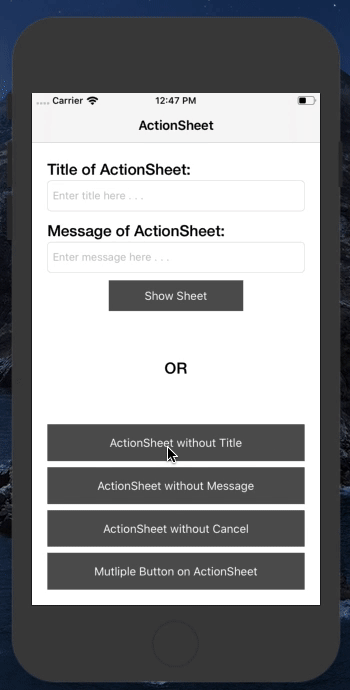

# ActionSheet

This is easy to use demo about UIAlertController (preffered Style: ActionSheet) with code held in one file and access in all other views. This demo is avaialble in both programming lanauage Objective-C & Swift.

# What is ActionSheet?

1. Appears as the result of a user action
2. Displays two or more buttons

Use an action sheet to:
1. **Provide alternative ways to complete a task.**
An action sheet lets you to provide a range of choices that make sense in the context of the current task, without giving these choices a permanent place in the UI.

2. **Get confirmation before completing a potentially dangerous task.**
An action sheet prompts users to think about the potentially dangerous effects of the step they’re about to take and gives them some alternatives.

# Output:



# Basic Config:

1. Xcode 10.0 or above
2. Objective-C
3. Swift 4.0 or above
4. Development Target 10.0 or above
5. Device Universal Supported

# How it Works?

You just need to download this demo and run it inot SIMULATOR or REAL device whatever you want. OR Just copy and paste code from Utility.swift | Utility.h & Utility.m file into your projects and access it!

There are two different project in this repositor:

1. **Objective-C** (Utility.h & Utility.m file)

```objective-c

typedef void (^ _Nullable completion)(int index);

+ (void)
shwoAlertControllerInViewController: (UIViewController *)vc withTitle: (nullable NSString *)title andMessage: (nullable NSString *)message withButtons: (NSArray *)button withCompletion: (completion)completionBlock
{
    UIAlertController *alertController = [UIAlertController alertControllerWithTitle:title message:message preferredStyle:UIAlertControllerStyleAlert];
    
    for (int index = 0; index < button.count; index++) {
        
        UIAlertAction *action = [UIAlertAction actionWithTitle:button[index] style:UIAlertActionStyleDefault handler:^(UIAlertAction * _Nonnull action) {
            
            if (completionBlock != nil) {

                completionBlock(index);
            }
        }];
        
        [alertController addAction:action];
    }
    
    [vc presentViewController:alertController animated:YES completion:nil];
}
```

2. **Swift** (Utility.swift file)

```swift
static func shwoActionSheetInViewController(vc: UIViewController, withTitle title: String?, andMessage message: String?, withButtons button: [String], cancelAvailable isCancel: Bool, completion:((_ index: Int) -> Void)!) -> Void
{
    let alertController = UIAlertController(title: title, message: message, preferredStyle: .actionSheet)

    for index in 0 ..< button.count  {

        let action = UIAlertAction(title: button[index], style: .default, handler: { (alert: UIAlertAction!) in

            if completion != nil {

                completion(index)
            }
        })

        alertController.addAction(action)
    }
        
    if isCancel {
            
        let action = UIAlertAction(title: "Cancel", style: .destructive, handler: { (alert: UIAlertAction!) in

            if completion != nil {

                completion(button.count)
            }
        })

        alertController.addAction(action)
    }
        
    if (UIDevice.current.userInterfaceIdiom == UIUserInterfaceIdiom.phone) {

        // if device is iPhone
        vc.present(alertController, animated: true, completion: nil)
    } else {
            
        // if device is iPad
        alertController.modalPresentationStyle = .popover

        if let popoverController = alertController.popoverPresentationController {
                
            popoverController.sourceView = vc.view
            popoverController.sourceRect = CGRect(x: vc.view.bounds.midX, y: vc.view.bounds.midY, width: 0, height: 0)
            popoverController.permittedArrowDirections = []
        }
    }
}
```

# License

This line of codes are avaialble for public use by [**9Brainz**](https://www.9brainz.com). If you have any doubts or query regarding this code or any particular topic reagrding iOS Application development, Feel free to [**Contact Us**](https://9brainz.com/contact-us.html).

# Helpful!!

Is this demo helpful for your project? OR Reducing tiny bit of work in your project?
Let us know about it 🔥🔥🔥
